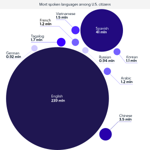

大家好，欢迎来到我的IT 趣英语。
今天我们来说说键盘上 最浪的符号

---
tilde：波浪号

til/tid: 倾斜
tilt: 也是一个单词，倾斜。
tide: 潮汐，浪潮

是不是特别地形象

因为这个符号实在是太形象了，
它大量地被用在了颜文字中，
表达效果上，完爆传统语言。

---

^_~ 表示调皮。
╮(～▽～)╭ 表示不满。
(╯#-_-)╯~~~~~~~╧═╧ 或者表示掀桌子

真的是一个比一个浪。

它还浪到了程序里：

---

 ～ 在程序里，
用来表示二进制的比特反转，
非常地酷炫。
而自然界的比特反转，是老天爷对人类电子科技的封印。
你说浪不浪？

比特反转封印我后面会介绍，特别有意思。

---
好了，
tilde symbol: 波浪号
就介绍到这里。

在浪翻传统语言的同时，
它的效果，还能浪翻编程语言，
那它可不就是最浪的符号嘛。

---

backquote

---

source：

来源：
来自西班牙语

西班牙语中，存在大量的这样的波浪号。

我们用的键盘不是美式键盘么，怎么会有西班牙语。
西班牙语是美国的第二语言。
所以，出现这样的符号也不足为奇。
